# Mildew Detection in Cherry Leaves

This project was developed for Farmy & Foods, a company in the agricultural sector that produces and harvests different types of food. Recently, the company has faced a challenge where their cherry plantations have been presenting powdery mildew, which is a fungal disease that affects a wide range of plants. The cherry plantation crop is one of their finest products and the company is concerned about supplying the market with a product of compromised quality.

Powdery mildew is a fungal disease that commonly affects cherry trees. It appears as a white or gray powdery substance on the leaves, stems, and sometimes fruit of the tree. The fungus responsible for powdery mildew thrives in warm, humid conditions and is spread through spores being carried by the wind.

The risk of infection with powdery mildew is relatively high in cherry trees, especially during periods of warm, humid weather. Once infected, the fungus can spread rapidly throughout the tree and cause damage to the leaves, reducing the tree's ability to photosynthesize and eventually impacting fruit production.

To prevent and manage powdery mildew in cherry trees, it is important to regularly inspect the tree for signs of infection and take prompt action to control the spread of the fungus. This may involve using fungicides, pruning affected branches, and practicing good plant hygiene to reduce the risk of infection.

Prior to completion of this project, Farmy & Foods employees would manually inspect leaves to establish if they were infected or healthy. This process would usually take around 30 minutes per tree. 

The main overall intention of the project was to create a Machine Learning System with the capability to instantly detect in an image of a leave was healthy or infected, this would ensure the company could continue to provide a high quality healthy product without the need for time consuming manual inspections.

## Dataset Content

The dataset for this project was provided by the client. It contained a total of 4208 images which were split into 2104 healthy images and 2104 powery mildew infected images of cherry leaves.

The dataset was sourced from Kaggle and can be accessed [here.](https://www.kaggle.com/datasets/codeinstitute/cherry-leaves)

## Business Requirements

As previously summerised, our client, Farmy & Foods are facing a challenge as a result of their Cherry Tree Plantation showing signs of powder mildew infection. It currently take employees around 30 minutes to inspect a cherry tree and confirm if it is healthy or infected. The company has thousands of cherry trees located in multiple farms across the country. As a result, this manual process is not scalable due to time spent in the manual process inspection. Our goal is to produce a Machine Learning System which is capable of examing images of the cherry tree leaves and confirming if they are healthy or infected.

The two business requirements identified for this project are - 
* The client is interested in conducting a study to visually differentiate a cherry leaf that is healthy from one that contains powdery mildew.
* The client is interested in predicting if a cherry tree is healthy or contains powdery mildew.

## Hypothesis and validation

### Hypothesis

Plants which are infected with powdery mildew show distinct markings on their leaves which indicate infection. The markings on an infected leaf are usually light powdery stripes and spots.

### How to Validate

In order to be able to validate this hypothesis firstly we must research powdery mildew infection, understand why and how it occurs and thereafter be able to recognise the signs and symptoms. Then, I must use the dataset provided by the client in order to create an image study which will allow us to investigate the images of leaves and use this to build a Machine Learning System capable of recognising if an image of a cherry leaf is either healthy or infected with powdery mildew.

### Validation

By displaying images of infected and healthy leaves we can visually compare them in order to establish differences in the leaves. This is done by creating an image montage to conduct the comparison of infected and healthy leaves. From analysis of the montage it can be seen that infected leaves show distinct white markings that the healthy leaves don't.

## The rationale to map the business requirements to the Data Visualizations and ML tasks

From each of the business requirements identified a number of user stories were created which subsequently became machine learning tasks.

### Business Requirement 1
* The client is interested in conducting a study to visually differentiate a cherry leaf that is healthy from one that contains powdery mildew.

#### User Stories

- As a client, I need a user-friendly dashboard to easily navigate in order to access and view study and image displays.
- As a client, I want to see the average image and variability of healthy and powdery mildew-infected leaves in the dataset to understand their differences.
- As a client, I want to compare the average images of healthy and infected leaves to see if there are noticeable distinctions.
- As a client, I would like to view a montage of images showing healthy and infected leaves in the dataset to visually compare the two.

These user stories were implemented by -

- The client dashboard was created using Streamlit with 6 pages and a easy to use menu for navigation.
- TensorFlow was used to load dataset images into an array in the Data Visualization notebook, enabling the display of average and variability for all images on the Cherry Leaf Visualizer Page in Dashboard.
- Users can visualize the difference between healthy leaves and infected leaves on the Cherry Leaf Visualizer page of the Dashboard.
- Users can create an image montage of healthy or infected cherry leaf images on the Cherry Leaf Visualizer page.

#### Average and Variability

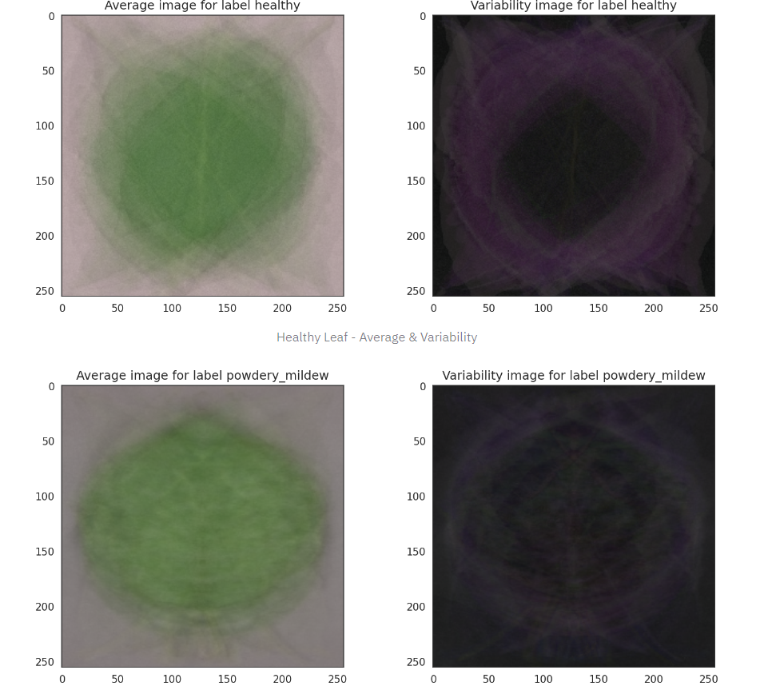

#### Difference between average healthy and infected leaves

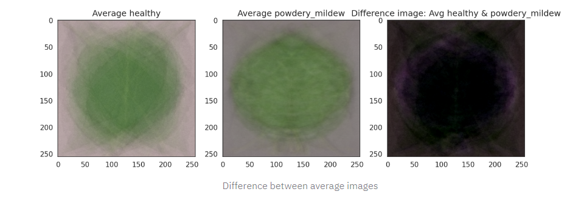

#### Image Montage of Healthy and Infected Leaves

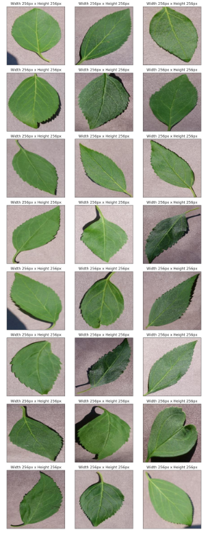

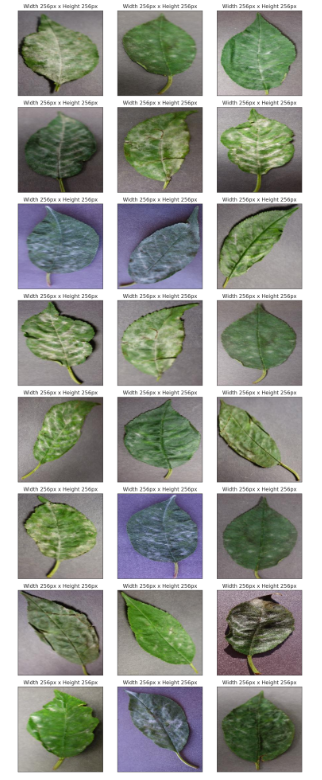

### Business Requirement 2
* The client is interested in predicting if a cherry tree is healthy or contains powdery mildew. 

#### User Stories

- As a client, I want a Machine Learning Model capable of predicting if a given image of a Cherry Leaf is Healthy or infected with Powdery Mildew with an accuracy of at least 97%.
- As a client, I was to be able to easily access the performance metrics so I can understand the accuracy of the Machine Learning Model.
- As a client, I want to be able to upload an image, or multiple images of Cherry Leaves to be quickly analysed so I can confirm which need treated as a result of being infected.
- As a client, I want to be able to download a copy of the prediction report.

These user stories were implemented by -

- A Machine Learning Model capable of predicting if a leaf is infected or not was created and when tested provided an accuaracy level of 98.1%, exceeding the clients expectations.
- The performance metrics for the Model are displayed in the ML_Performance page.
- In the mildew infection detector page users can upload an image, or multiple images at the same time, for prediction. This allows for a quick analysis to be conducted and provides the client with confirmation if the leaves are healthy or infected.
- Users can download a copy of a prediction report which they can save for their own use.

### Machine Learning Business Case

Our goal is to create a machine learning model that predicts if a leaf is infected with Powdery Mildew using a dataset provided by the client consisting of images of cherry leaves, both healthy and infected. The model will be a binary classifier for infected and uninfected leaves, aiming for a minimum 97% accuracy on the test set. Employees will manually upload leaf images to the application for real-time predictions, streamlining the diagnostic process. Currently, manual diagnosis is time-consuming and error-prone, with scalability being a concern due to the large number of cherry trees. The dataset used for training and evaluation contains over 4,000 cherry leaf images provided by our client, Farmy & Foods. '
This will help the client speed up the process of inspecting Cherry Leaves and if successfully will be rolled out into other crops throughout the clients business.

A Convolutional Neural Network (CNN) will be created to examine pre-labeled leaf images. The network will be programmed to recognize the main characteristic within the dataset, specifically the existence of powdery mildew infection in the cherry leaf images.

### Model Creation

The model created for this project is a Convolutional Neural Network (CNN) for image classification. It consists of three convolutional layers with max pooling after each convolutional layer to downsample the feature maps. After the convolutional layers, there is a flatten layer to transform the 2D feature maps into a 1D vector. This is followed by two fully connected layers with activation functions and dropout regularization. The output layer has two neurons with softmax activation for binary classification. The model is compiled with categorical cross-entropy loss function, Adagrad optimizer, and accuracy as the metric.

### Model Performance and training

A learning curve illustrates the model's learning performance over time or experience. It is a common tool used in machine learning to assess algorithms that learn from a training dataset gradually. By evaluating the model's performance on both the training dataset and a separate validation dataset after each update during training, learning curves can be plotted to identify any issues, such as underfit or overfit models, and determine if the datasets are appropriately representative. In general, a learning curve typically displays the number of training passes (Epoch) on the x-axis and the level of learning or improvement (Loss/Accuracy) on the y-axis. The goal is to find a good fit for the learning algorithm, where the training and validation loss converge to stable values with minimal difference. It is important to note that a gap between the two curves, known as the "generalization gap," is expected. Continued training of a well-fitted model may lead to overfitting, which is why early stopping is typically implemented in machine learning models to prevent this.

For the model used in this project 20 epochs were used for training.

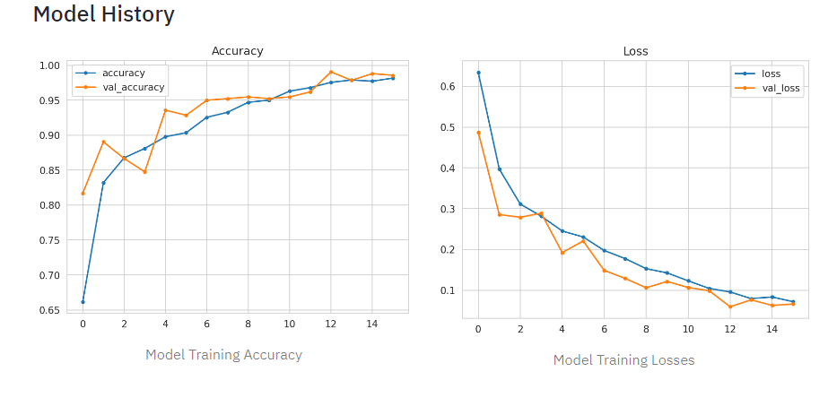

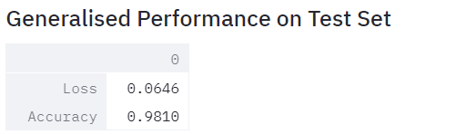

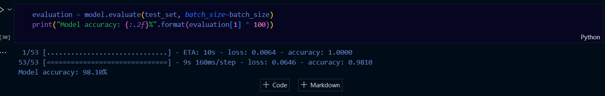

### Conclusion

- Infected leaves can be clearly differentiated from healthy leaves due to the white markings visible on infected leaves.
- Following testing of our model the learning curve and performance of the test sets shows the model is operating accurately and can predict if a cherry leaf if either infected wth powdery mildew or healthy with a high degree of accuracy.
- The client asked for the model to achieve 97% accuracy. Our evaluation of our saved model shows it is operating at 98.1% accuracy, therefore exceeding the clients expectations! 

## Dashboard Design

The Dashboard created for this project consists of five pages in total.

### Summary Page

- On this page the project is summerized and broken down into a number of sections namely -
    - General informaiton about Powdery Mildew Infection.
    - The project and business requirements.
    - The content of the dataset used explained
    - A link for the user to access this README

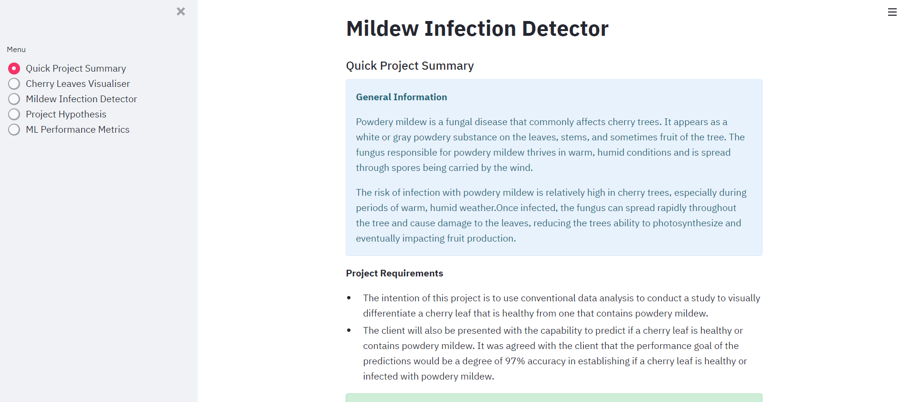

### Cherry leaf Visualizer Page
- On this page users can use three checkboxes to -
    - View the difference between average and variability image
    - View the differences between average mildew infected and healthy leaves
    - Create an Image Montage of either infected or healthy leaves. 

- This page successfully answers Business Requirement 1.

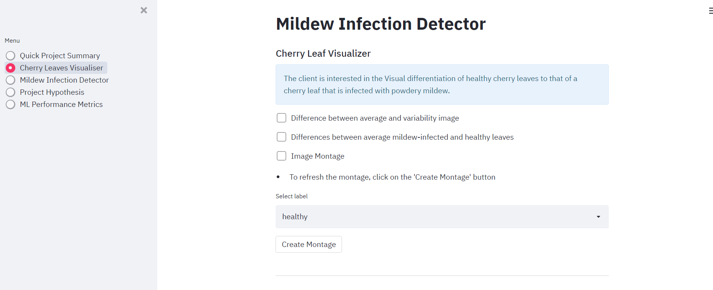

### Mildew Infection Detector Page
- This page is where users can use the model to make a live prediction on weather cherry leaves are healthy or infected.
    - The user can download a set of images of Cherry Leaves.
    - The page contains an upload widget allowing them to upload an image, or multiple images for the model to predict on.
    - The user is provided an instant prediction on the images they have uploaded along with the probability metrics.
    - The user can download the prediction report in a ```.csv``` format. 

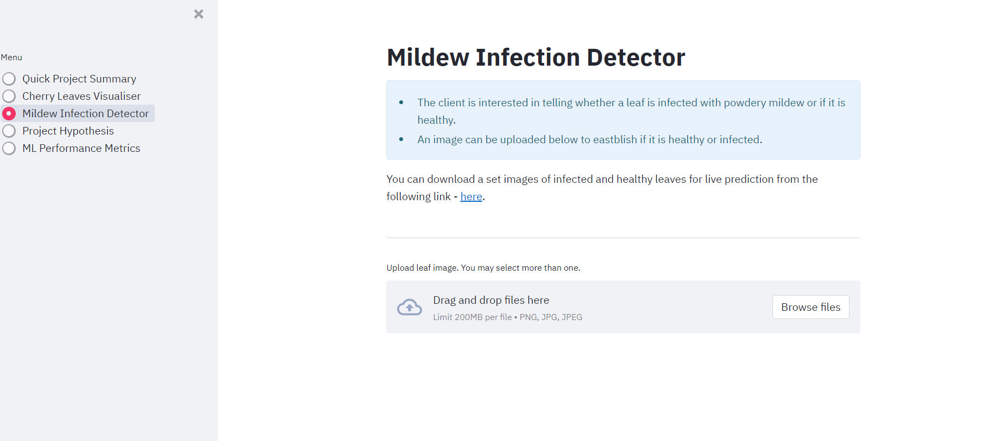

- This page successfully answers Business Requirement 2.
  
### Project Hypothesis Page
- This page provides details on the project Hypothesis and how it was validated. 

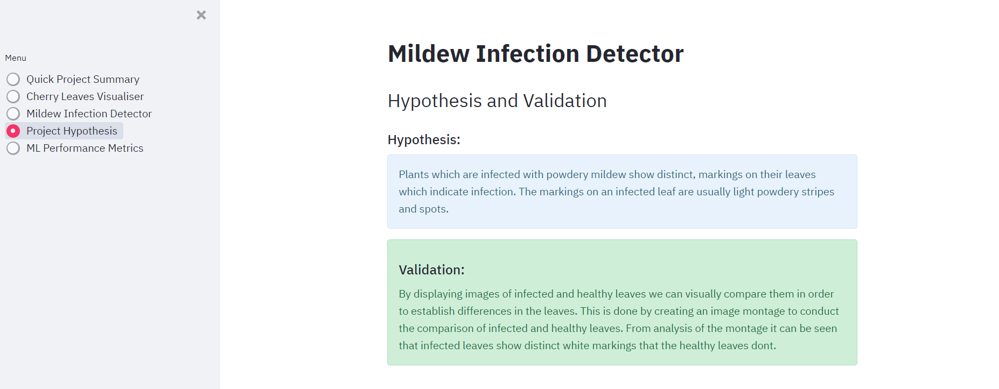

### ML Performance Page
- This page shows how the dataset was divided to fit and train the model and also how the model performs.
    - Label Frequencies for Train, Validation and Test Sets
    - Model History - Accuracy and Losses of Model
    - Model evaluation result on Test set

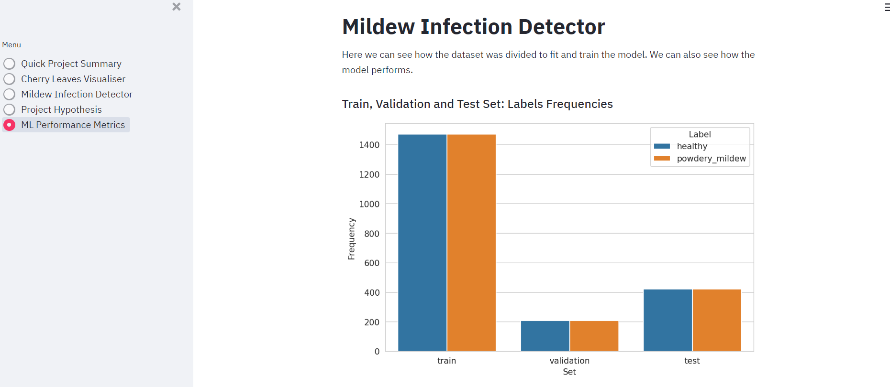

## Bugs

There were no bugs encountered during this project.

## Deployment
The project code is stored on GitHub and deployed with [Heroku](https://www.heroku.com/). 
The steps needed to deploy this projects are as follows:

### Heroku

* The App live link is: https://YOUR_APP_NAME.herokuapp.com/ 
* Set the runtime.txt Python version to a [Heroku-20](https://devcenter.heroku.com/articles/python-support#supported-runtimes) stack currently supported version.
* The project was deployed to Heroku using the following steps.

1. Log in to Heroku and create an App
2. At the Deploy tab, select GitHub as the deployment method.
3. Select your repository name and click Search. Once it is found, click Connect.
4. Select the branch you want to deploy, then click Deploy Branch.
5. The deployment process should happen smoothly if all deployment files are fully functional. Click now the button Open App on the top of the page to access your App.
6. If the slug size is too large then add large files not required for the app to the .slugignore file. 

## Cloning this repository

In order to work on this repository you will first need to clone it.

**Instructions to clone the repository**:

1 - While in the GitHub repository, click on the green code button.

2 - Copy the link.

3 - In your IDE or local coding environment use the link to open the repository. 

For example: in CodeAnywhere
- Click on 'Add new workspace'
- You will then be given the option to 'Create from your project repository' and a box in which to paste the link
- CodeAnywhere will now open a new workspace containing the repository.
- You should now be set up ready to work on the repository.

## Forking a branch

In order to protect the main branch while you work on something new, essential when working as part of a team or when you want to experiment with a new feature, you will need to fork a branch.

**Instructions to fork the repository**:

1 - While in the GitHub repository, click on the branch symbol and text indicating the number of branches.

2 - This will load details on current branches. Click on the green 'New branch' button.

3 - Enter a name for the new branch and then click the green 'create new branch' button.

4 - Your new branch should now have appeared on the screen.

5 - Clicking on the new branch and then following the steps for cloning will allow you to open up and work on this branch.

## Technologies used

### Platforms
- [Kaggle](https://www.kaggle.com/) for the cherry leaf image dataset
- [GitHub](https://github.com/) online cloud storage where the projects code is stored
- [Gitpod](https://gitpod.io/) as a cloud-based IDE for development
- [Jupyter](https://jupyter.org/) for the project's CRISP-DM workflow and development
- [Streamlit](https://streamlit.io/) Used to create the dashboard for the deployed project
- [Heroku](https://heroku.com/) cloud-based platform used to deploy the project

### Languages
- [Python](https://www.python.org/)
- [Markdown](https://en.wikipedia.org/wiki/Markdown)
  
### Main Data Analysis and Machine Learning Libraries
- [NumPy](https://numpy.org/) for converting images to an array
- [Pandas](https://pandas.pydata.org/) for creating dataframes
- [Matplotlib](https://matplotlib.org/) for data visualization
- [Plotly](https://plotly.com/python/) for data visualization
- [TensorFlow](hhttps://www.tensorflow.org/api_docs) for implementing best practices in data automation, model tracking, performance monitoring
- [Scikit-learn](https://scikit-learn.org/) for image classification

### Installed Packages
- numpy==1.19.2
- pandas==1.1.2
- matplotlib==3.3.1
- seaborn==0.11.0
- plotly==4.12.0
- streamlit==0.85.0
- scikit-learn==0.24.2
- tensorflow-cpu==2.6.0
- keras==2.6.0
- protobuf==3.20
- altair<5

## Credits 

### Content
- The dataset for the cherry leaves was obtained from [Kaggle](https://www.kaggle.com/datasets/codeinstitute/cherry-leaves) and created by [Code Institute](https://www.kaggle.com/codeinstitute)
- The content describing powdery mildew infection in cherry leaves used throughout the project was written by the developer using information gleaned from the online research of the following -
    - [wikipedia - powdery mildew](https://en.wikipedia.org/wiki/Powdery_mildew)
    - [treefruit - cherry-powdery-mildew](https://treefruit.wsu.edu/crop-protection/disease-management/cherry-powdery-mildew/)
    - [RHS - Powdery-Mildews](https://www.rhs.org.uk/disease/powdery-mildews)

### Code
- The template used to create this project was provided by, and belong to [Code Institute](https://codeinstitute.net/) and can be accessed below.
    - [Code Institute - Github - Milestone project mildew detection in cherry leaves](https://github.com/Code-Institute-Solutions/milestone-project-mildew-detection-in-cherry-leaves)
- Whilst completing this project I have followed the code used in the [Code Institute](https://codeinstitute.net/) Predictive Analytics - Malaria Detector/Walkthrough Project 1 to assist in structuring this projects Data Collection, Data Visualization and Modelling and Evaluation notebooks as well as the app pages for the Streamlit dashboard.

### Acknowledgements

* My Code Institute Mentor, Mo Shammi for his continuous feedback, help, guidance and expertise throughout this project.
* My fellow users of the Code Institute Slack Channel for their support, feedback and help. 
